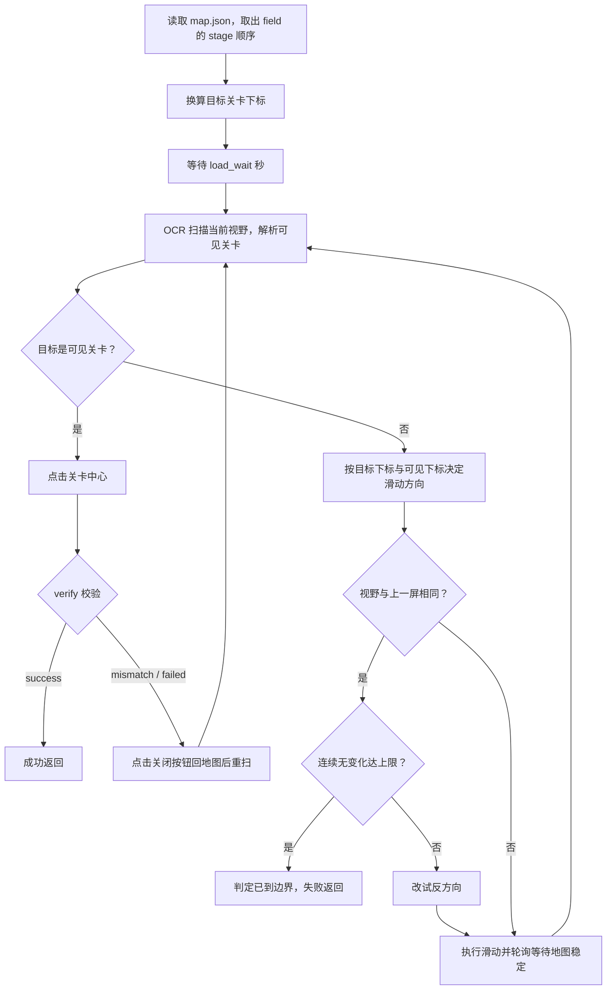

# 通用选关

<Badge text="开发中功能" type="warning" />

Custom Action：`Stage_Select`

文件：`agent/custom/action/stage_select.py`

数据表：`assets/resource/stage/map.json`

Schema：`tools/schema/stage_map.schema.json`

## 功能概述

用于在选关地图上自动定位并点击目标关卡。

选关地图的形状因玩法而异（主线按章节、资源收集按区域等），关卡在屏幕上的排列顺序也各不相同。
`Stage_Select` 不在代码里假设任何规律，而是把每张地图的关卡顺序写进 `map.json`，运行时按
“目标在可见关卡左侧则回退、其余情况前进”的方式逐屏收敛，直到目标关卡出现在视野中并点击。

与 Pipeline 写法的差别：Pipeline 需要为每个关卡各写一个模板匹配节点，并靠 `Swipe2next` 的
`max_hit` 手动控制滑动次数；`Stage_Select` 只需在 `map.json` 里加一行关卡名。

## 快速使用

在 pipeline 中调用：

```jsonc
{
    "MyStage_Select": {
        "action": {
            "type": "Custom",
            "param": {
                "custom_action": "Stage_Select",
                "custom_action_param": {
                    "field": "MaterialQuests_2",
                    "stage": "2-3"
                }
            }
        }
    }
}
```

调用前该节点需已完成导航，停留在对应玩法的选关地图界面。

### 参数

`field` 与 `stage` 必填，其余参数可省略（缺省时先用 `custom_action_param` 的值，
再回退到 `map.json` 中该 field 的配置，最后回退到类内默认值）。

| 参数 | 默认 | 说明 |
| --- | --- | --- |
| `field` | 必填 | 选关地图名，须为 `map.json` 中的顶层 key |
| `stage` | 必填 | 目标关卡，须在该 field 的 `stage` 顺序中 |
| `roi` | `[0, 200, 1280, 400]` | 选关地图 OCR 区域 |
| `swipe_begin` | `SceneDo_Swipe_Stage_Swipe2begin` | 向左（回退）滑动的 pipeline 节点名 |
| `swipe_next` | `SceneDo_Swipe_Stage_Swipe2next` | 向右（前进）滑动的 pipeline 节点名 |
| `load_wait` | `5` | 进入选关界面后的等待秒数 |
| `max_swipes` | `50` | 最多滑动次数（安全上限） |
| `swipe_wait` | `3` | 每次滑动后等待地图稳定的上限秒数 |
| `verify` | `true` | 点击后是否 OCR 校验进入的关卡 |
| `verify_roi` | `[130, 25, 290, 70]` | 校验用关卡标题 OCR 区域 |
| `verify_wait` | `3` | 点击后等待关卡详情加载的秒数 |

## 数据表格式

`map.json` 顶层 key 即 `field` 名，value 描述该地图的关卡排布与滑动参数。
文件支持 JSONC 注释（`//` 与 `/* */`），可用 `region` 分组标注，注释不影响加载。

```jsonc
{
    "MaterialQuests_2": {
        "desc": "资源收集-作战体能训练",
        "stage": [
            "2-1",
            "2-2",
            "2-3",
            "2-4",
            "2-5"
        ]
    }
}
```

| 字段 | 说明 |
| --- | --- |
| `desc` | （可选）地图描述，仅用于日志可读性 |
| `stage` | **必填**，地图上从左到右的关卡顺序，如 `["1-1", "1-2"]` |
| `roi` | （可选）选关地图 OCR 区域，默认 `[0, 200, 1280, 400]` |
| `swipe_begin` | （可选）向左（回退）滑动的 pipeline 节点名 |
| `swipe_next` | （可选）向右（前进）滑动的 pipeline 节点名 |
| `load_wait` | （可选）进入选关界面后的等待秒数，默认 `5` |
| `max_swipes` | （可选）最多滑动次数（安全上限），默认 `50` |
| `swipe_wait` | （可选）每次滑动后等待地图稳定的上限秒数，默认 `3` |
| `verify` | （可选）点击后是否校验进入的关卡，默认 `true` |
| `verify_roi` | （可选）校验用关卡标题 OCR 区域 |
| `verify_wait` | （可选）点击后等待关卡详情加载的秒数，默认 `3` |

顶层 key 即 field 名（字母或下划线开头）；文件顶部的说明直接用 JSONC 注释书写。

## 工作流程



方向判定规则：

- 目标下标 **小于** 可见关卡的最小下标 → 回退（`swipe_begin`）
- 其余情况（目标在右侧，或目标下标落在可见范围内却未识别到）→ 前进（`swipe_next`）
- 本屏未识别到任何本图关卡 → 维持上一次方向重试

## 语义要点

- **只认本图关卡**：OCR 原文先解析成关卡标识，再要求该标识存在于当前 field 的 `stage` 里。
  相邻选关地图的关卡即使被识别到也会被忽略，不会干扰方向判断。
- **按 x 坐标排序**：同屏识别到的多个关卡按 OCR box 的中心 x 从左到右排序，以此确定“最左/最右可见关卡”。
- **不按字符串比对**：OCR 原文先经二次处理解析成 `StageKey`（章节号 + 关卡号 + EX 标记）再比对，
  而不是“去掉符号转大写后比字符串”。因此 `EX 2 - 1`、`ex2-1`、`第2-1关` 都能解析成同一个
  `StageKey(2, 1, ex=True)`，且 `1-1` 不会被 `1-11` 误判为同一关（字段相等而非子串包含）。
- **校验兼容 EX 前缀丢失**：`verify` 比对时，若目标为 `EX2-1`，同时接受 OCR 识别成 `2-1` 的情况。
- **滑动节点由数据决定**：不同地图可能使用不同的滑动节点，因此节点名写在 `map.json` 里而非硬编码。
- **自适应等待滑动稳定**：滑动后不固定 sleep，而是轮询识别直到「可见关卡及其位置连续两次相同」
  （位置按 8 像素量化，避免 OCR 抖动），最多等 `swipe_wait` 秒。固定时长在真机上不适用——
  惯性动画时长不确定，偏短会 OCR 到中间帧、偏长则白白空等。识别不到关卡时**不**判定为稳定
  （无法区分“仍在动画中”与“已滑出地图”），交由盲滑兜底处理。
- **边界判定只看视野不看方向**：滑动后若可见关卡集合与上一屏完全相同，说明该方向已到边界，
  会反向再试一次；连续 `MAX_UNCHANGED_VIEWS` 次无变化即判定到边界并失败。判定键刻意不含方向——
  方向会被“改试反方向”改动，若把方向纳入判定键，翻转后必然与上一屏不等，计数会被反复清零
  （这样这个兜底就形同虚设，只能靠 `MAX_SAME_VIEW` 兜住，且方向会在两端无意义横跳）。

## 容错与兜底

选关循环中任何一处卡住都必须能退出，为此设了多重上限：

| 兜底 | 阈值 | 触发结果 |
| --- | --- | --- |
| 同一位置重复点击 | 超过 `MAX_CLICK_ATTEMPTS`（3） | 点击后始终未进入目标关卡 → 失败返回 |
| 同一屏反复出现 | 超过 `MAX_SAME_VIEW`（4） | 疑似在两点间往复 → 失败返回 |
| 滑动后视野无变化 | 连续达到 `MAX_UNCHANGED_VIEWS`（2） | 已到地图边界仍找不到 → 失败返回 |
| 识别到地图后连续扫不到关卡 | 超过 `MAX_BLIND_SCANS`（6） | 疑似已滑出地图 → 失败返回 |
| 总滑动次数 | 超过 `max_swipes`（50） | 达到上限 → 失败返回 |

区分“界面未就绪”与“盲滑”：一开场就扫不到关卡时允许继续尝试到 `max_swipes`（界面可能仍在加载），
而**一旦成功识别过地图**后又连续扫不到，才按滑出地图提前失败。

校验分支的处理：

- `success`：已进入目标关卡 → 成功返回
- `mismatch`：进入了其他关卡 → 点击 `UI_Combat_StageDetails_Close` 关闭详情，回地图重扫
- `failed`：未识别到关卡名（可能仍在加载）→ 同样关闭详情后重扫

若确认无需校验（例如后续 pipeline 会自行确认状态），可将 `verify` 设为 `false`，点击后直接成功返回。

## Schema 校验

`tools/schema/stage_map.schema.json` 描述了数据表的合法结构（如 `stage` 必填、关卡名须形如
`1-1` / `EX2-2`、`roi` 为 4 个整数等），已在 `.vscode/settings.json` 注册，编辑时 VS Code 会实时校验
并给出补全提示。

::: tip
`stage_map.schema.json` 放在 `tools/schema/` 而非资源目录，因为 `assets/resource/**` 会被
`tools/install.py` 整个拷贝进安装包，而 schema 只在开发时供编辑器使用，运行时不需要。
`map.json` 则必须留在 `assets/resource/stage/`（agent 运行时需读取）。
:::

::: tip
`assets/resource/stage/` 不是 `pipeline/` 目录，MaaFramework 不会把它当 pipeline 解析，
因此 `map.json` 里写关卡顺序等自定义结构不会导致资源加载报错。
:::

## 与 Activity_Stage_Select 的区别

项目中有两个选关 custom，适用于不同场景：

| | `Stage_Select` | `Activity_Stage_Select` |
| --- | --- | --- |
| 文件 | `agent/custom/action/stage_select.py` | `agent/custom/action/activity/stage_select.py` |
| 定位依据 | `map.json` 中的关卡顺序 | 关卡名中的 EP（章节）编号 |
| 适用场景 | 通用选关地图 | 活动关卡地图 |
| 点击后行为 | 可配置校验，另有关闭详情重寻 | 固定校验，并处理“挑战次数已耗尽”分支 |

`Activity_Stage_Select` 依赖关卡名形如 `EX2-1` → EP2 的规律，划动到目标 EP 开头后再逐屏寻找；
`Stage_Select` 不做这种假设，因此关卡排布不规则的地图应使用后者。
