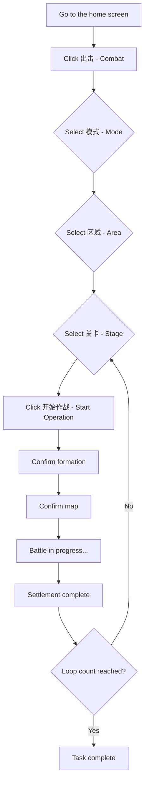

::: warning AI Translation Notice
This document was translated using AI. Please refer to the Chinese documentation for the definitive version.
:::

# Auto Battle (自动战斗)

<Badge text="Experimental Feature" type="tip" />Automatically clears stages.

It can be used to farm stages where **快速战斗** (“Quick Battle”) has not been unlocked because the stage has not yet been cleared with three stars.

---

## What Does This Feature Do?

When you use **自动战斗** (“Auto Battle”), MAK will automatically:

1. Enter the **出击** (“Combat”) page.
2. Navigate to the appropriate **stage mode** according to your settings: **主线任务** (“Main Story”), **资源收集** (“Resource Collection”), or **技能演练** (“Skill Training”).
3. Enter the appropriate **area** and swipe to select the **specific stage** you want to play.
4. Tap **开始作战** (“Start Operation”), then complete **编队确认** (“Formation Confirmation”), **地图确认** (“Map Confirmation”), and the other steps.
5. Operate automatically during the battle until settlement is complete.
6. Repeat the battle according to the configured **循环次数** (“Loop Count”).

> Currently, only stages with relatively simple flows are supported, such as **特别军费行动** (“Special Military Funding Operation”) and **作战体能训练** (“Combat Fitness Training”) under **资源收集** (“Resource Collection”).

---

## How Do I Configure It?

| Setting | Description |
|---------|-------------|
| **模式** (“Mode”) | Select the mode containing the stage: 主线任务 (“Main Story”), 资源收集 (“Resource Collection”), or 技能演练 (“Skill Training”) |
| **区域选择** (“Area Selection”) | Select the area containing the stage (only applies in 资源收集 (“Resource Collection”) mode) |
| **关卡选择** (“Stage Selection”) | Select the specific stage to play |
| **循环次数** (“Loop Count”) | Set the number of repetitions; the default is 1, and the value must be an integer greater than 0 |

---

## Currently Supported Content

### Resource Collection (资源收集)

| Area | Supported stages |
|------|------------------|
| 特别军费行动 (Special Military Funding Operation) | 1-1, 1-2, 1-3, 1-4, 1-5 |
| 作战体能训练 (Combat Fitness Training) | 2-1, 2-2, 2-3, 2-4 |
| 兵种能力评级 (Unit-Type Proficiency Assessment) | Not yet supported |
| 载具对抗演练 (Vehicle Combat Exercise) | Not yet supported |

### Main Story / Skill Training (主线任务 / 技能演练)

> No specific stages are supported yet. Support will be added gradually in future versions.

---

## Execution Flow

---

## Notes

- Before using this feature, make sure you are logged in to the game.
- **Do not operate the emulator** while the task is running.
- If you need a particular formation, configure it in the game beforehand. MAK does not currently change formations.
- Do not set **循环次数** (“Loop Count”) too high. MAK cannot currently handle insufficient stamina.
