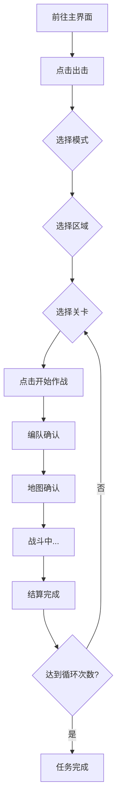

# 自动战斗

<Badge text="实验性功能" type="tip" />自动通过关卡。

可以用于刷取某些因为没有三星通过而未解锁快速战斗的关卡。

---

## 这个功能会做什么？

当你使用「自动战斗」功能时，MAK 会自动：

1. 进入**出击**页面
2. 根据你的设置，导航到对应的**关卡模式**（主线任务 / 资源收集 / 技能演练）
3. 进入对应的**区域**，滑动选择你要打的**具体关卡**
4. 自动点击「开始作战」，完成编队确认、地图确认等步骤
5. 战斗中自动进行操作直至结算完成
6. 根据你设置的**循环次数**，重复进行某关的战斗

> 目前仅支持操作流程比较简单的关卡，比如资源收集中的特别军费行动、作战体能训练等副本。

---

## 如何配置？

| 设置项 | 说明 |
|-------|------|
| **模式** | 选择关卡所在模式：主线任务 / 资源收集 / 技能演练 |
| **区域选择** | 选择关卡所在区域（仅在资源收集模式下生效） |
| **关卡选择** | 选择具体要打的关卡 |
| **循环次数** | 设置重复执行的次数，默认为 1，必须输入大于 0 的整数 |

---

## 当前支持的内容

### 资源收集

| 区域 | 支持关卡 |
|------|---------|
| 特别军费行动 | 1-1、1-2、1-3、1-4、1-5 |
| 作战体能训练 | 2-1、2-2、2-3、2-4 |
| 兵种能力评级 | 待适配 |
| 载具对抗演练 | 待适配 |

### 主线任务 / 技能演练

> 当前尚未适配具体关卡，将在后续版本中逐步支持。

---

## 运行流程

---

## 注意事项

- 使用前请确保游戏已经登录游戏
- 运行过程中**不要操作模拟器**。
- 如果需要特定的编队配置，请在游戏中提前设置好。目前不会更改编队。
- 循环次数不宜设置过大，目前无法处理体力不足的情况。
